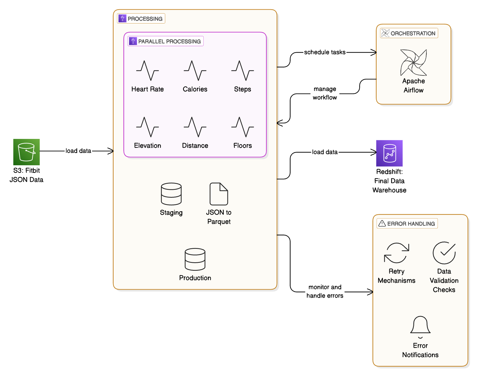

# Fitbit Intraday Data Processing Pipeline

A cloud-based data processing pipeline that extracts Fitbit intraday activity data from S3, transforms it into Parquet format, and loads it into Amazon Redshift using AWS Glue and Apache Airflow.

## Architecture Overview



The pipeline consists of four main components:

1. **Data Processing**
   - Parallel processing of 6 activity types:
     - Heart Rate
     - Calories
     - Steps
     - Elevation
     - Distance
     - Floors
   - JSON to Parquet conversion
   - Staging and Production data layers

2. **Orchestration**
   - Apache Airflow for workflow management
   - Weekly scheduled execution
   - Task dependency management

3. **Data Flow**
   - Source: S3 (Fitbit JSON Data)
   - Processing: AWS Glue ETL
   - Destination: Amazon Redshift

4. **Error Handling**
   - Retry mechanisms
   - Data validation checks
   - Error notifications

## Data Processing Details

This pipeline handles the following types of Fitbit activity data:
- Heart rate and heart rate zones 
- Calories burned
- Steps taken
- Elevation
- Distance traveled
- Floors climbed

Data is processed at both daily summary and intraday (minute-by-minute) levels.

## Prerequisites

- AWS Account with access to:
  - S3 buckets (source and destination)
  - AWS Glue
  - Amazon Redshift
  - IAM roles and permissions
- Apache Airflow environment
- Python 3.6+

## Key Features

- Parallel activity processing
- In-memory metadata tracking
- Two-stage loading (staging to production)
- Automated error handling and retries
- Data validation and quality checks

## Configuration

### Environment Variables

The pipeline can be configured using environment variables:

#### S3 Configuration
- `FITBIT_SOURCE_BUCKET`: Source bucket for Fitbit data
- `FITBIT_SOURCE_PREFIX`: Prefix for Fitbit data files
- `FITBIT_DEST_BUCKET`: Destination bucket for processed data
- `FITBIT_DEST_PREFIX`: Prefix for processed data
- `GLUE_SCRIPTS_BUCKET`: Bucket containing Glue scripts

#### Redshift Configuration
- `REDSHIFT_DATABASE`: Redshift database name
- `REDSHIFT_SCHEMA`: Redshift schema name (default: 'rural')
- `REDSHIFT_TEMP_DIR`: S3 location for temporary files

#### AWS Configuration
- `AWS_REGION`: AWS region for services
- `GLUE_JOB_PREFIX`: Prefix for Glue job names

### Airflow Configuration

1. Set up Redshift connection in Airflow:
   ```bash
   airflow connections add 'redshift_default' \
     --conn-type 'postgres' \
     --conn-host 'your-redshift-host' \
     --conn-schema 'your-database' \
     --conn-login 'your-username' \
     --conn-password 'your-password' \
     --conn-port 5439
   ```

2. Set up AWS connection:
   ```bash
   airflow connections add 'aws_default' \
     --conn-type 'aws' \
     --conn-login 'your-access-key-id' \
     --conn-password 'your-secret-access-key' \
     --conn-extra '{"region_name": "your-region"}'
   ```

### Local Development

For local development, create a `.env` file:

```env
# S3 Configuration
FITBIT_SOURCE_BUCKET="bucket name"
FITBIT_SOURCE_PREFIX="data source"
FITBIT_DEST_BUCKET="destination bucket"
FITBIT_DEST_PREFIX="dest prefix"
GLUE_SCRIPTS_BUCKET=your-glue-scripts-bucket

# Redshift Configuration
REDSHIFT_DATABASE=your_database
REDSHIFT_SCHEMA=rural
REDSHIFT_TEMP_DIR=s3://your-temp-bucket/temp/

# AWS Configuration
AWS_REGION=us-east-1
GLUE_JOB_PREFIX=rural_fitbit
```

### Production Deployment

For production deployment:

1. Set environment variables in your Airflow environment
2. Configure AWS Glue job parameters in the AWS console
3. Ensure proper IAM roles and permissions are set up

## Error Handling

The pipeline includes comprehensive error handling:
- Automatic retries for failed tasks
- Data validation checks
- Error notifications
- Processing statistics tracking

## Monitoring

Monitor the pipeline through:
- Airflow web interface
- AWS CloudWatch logs
- Processing statistics
- Error notifications
